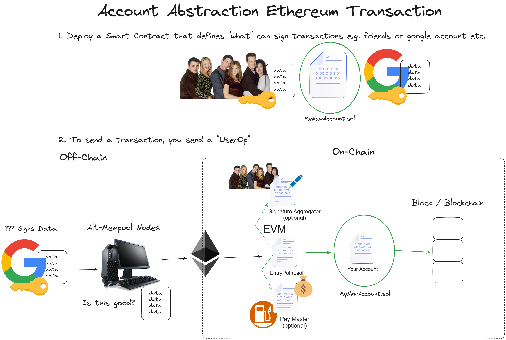
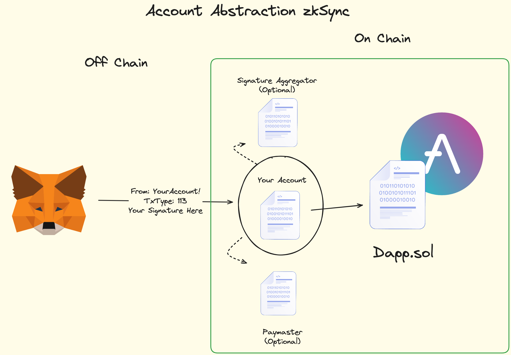

# Account Abstraction

- [Account Abstraction](#account-abstraction)
  - [What is Account Abstraction?](#what-is-account-abstraction)
  - [What's in this repo?](#whats-in-this-repo)
  - [Things to do](#things-to-do)
  - [How it works in Ethereum](#how-it-works-in-ethereum)
  - [How it works in ZKSync](#how-it-works-in-zksync)


## <ins>What is Account Abstraction?</ins>

EoAs are now smart contracts. That's all account abstraction is.

Right now, every single transaction in web3 stems from a single private key. 

account abstraction means that not only the execution of a transaction can be arbitrarily complex computation logic as specified by the EVM, but also the authorization logic.

Resources: 
- [Vitalik Buterin](https://ethereum-magicians.org/t/implementing-account-abstraction-as-part-of-eth1-x/4020)
- [EntryPoint Contract v0.6](https://etherscan.io/address/0x5ff137d4b0fdcd49dca30c7cf57e578a026d2789)
- [EntryPoint Contract v0.7](https://etherscan.io/address/0x0000000071727De22E5E9d8BAf0edAc6f37da032)
- [zkSync AA Transaction Flow](https://docs.zksync.io/build/developer-reference/account-abstraction.html#the-transaction-flow)

## <ins>What's in this repo?</ins>

1. A minimal EVM "Smart Wallet" using alt-mempool AA
   1. We even send a transactoin to the `EntryPoint.sol`
2. A minimal zkSync "Smart Wallet" using native AA
   1. [zkSync uses native AA, which is slightly different than ERC-4337](https://docs.zksync.io/build/developer-reference/account-abstraction.html#iaccount-interface)
   2. We *do* send our zkSync transaction to the alt-mempool


## <ins>Things to do</ins> 

1. Create a basic Account Abstraction on Ethereum.
2. Create a basic Account Abstraction on zkSync.
3. Deploy, and send a userOp / transaction through them.
    1. Not going to send an AA to Ethereum
    2. But send an AA tx to zkSync sepolia

## <ins>How it works in Ethereum</ins> 

<p align="center">

<br/>

1. Anything can validate a transaction whatever we want , all we have to do is code a smart contract that says here is what that signs my transaction.
2. Once we deploy this , when we actually wanna send a transaction, we first sign the data and we send to a group of Alt-Mempool nodes.
3. These nodes are gonna be the one to combine everything into a single `User Operation` & call the `handleOps` function on the `EntryPoint.sol` contract.
4. This function will do a lot of validation then if it looks good it will call your account contract, then it will execute/call the daap its working with etc.
5. This is really fantastic because you can sign and send transactions where you don't pay any gas , if you have set up a `Pay Master` .
6. The main function is `MinimalAccount::validateUserOp` , instead of sending a regular transaction object to the blockchain , those alt-mempool nodes will send the user operations to `EntryPoint.sol` contract, which will call `MinimalAccount.sol` contract & execute the custom logic coded for validate user operations.
    - If the Transaction is valid, and the signature associated to it are also valid, it will then call `MinimalAccount::execute` function.

## <ins>How it works in ZKSync</ins>

<p align="center">

<br/>

- Account Abstraction is built directly into ZKSync, On ZKsync you can have a smart contract wallet that acts as an EOA with native account abstraction built in unlike ethereum.

- Lifecycle of a type 113 (0x71) transaction - `msg.sender` is the `bootloader` system contract

- Phase 1 : Validation

    1. The user sends the transaction to the "zkSync API client" (sort of a "light node").
    2. The zkSync API client checks to see the nonce is unique by querying the NonceHolder system contract.
    3. The zkSync API client calls validateTransaction, which MUST update the nonce.
    4. The zkSync API client checks the nonce is updated.
    5. The zkSync API client calls payForTransaction, or prepareForPaymaster & validateAndPayForPaymasterTransaction.
    6. The zkSync API client verifies that the bootloader gets paid.

- Phase 2 : Execution

    7. The zkSync API client passes the validated transaction to the main node/sequencer iff it gets validated first by light nodes so we dont get denial of service attack.
    8. The main node calls executeTransaction.
    9. If the paymaster was used, the postTransaction is called.


> One of the big difference between **Native Account Abstraction** & **EntryPoint based Account Abstraction** is that:

> - In EntryPoint based AA, the `from` is gonna be whatever node or user who actually created the transaction.
> - Whereas, On ZKsync with Native AA , the `from` is actually gonna be the smart contract wallet itself.   

### commands used : 
```
forge install eth-infinitism/account-abstraction@v0.7.0 --no-commit
forge install openzeppelin/openzeppelin—contracts@v5.0.2 --no-commit
forge install Cyfrin/foundry-devops --no-commit

# For Installing foundry-zksync packages:-
git clone https://github.com/matter-labs/foundry-zksync.git
cd foundry-zksync
./install-foundry-zksync
foundryup-zksync

# Validation Transaction Test for ZKSync
forge test --mt testZkValidateTransaction --zksync --system-mode=true

# deploy on zksync (sepolia)  
yarn deploy
```
